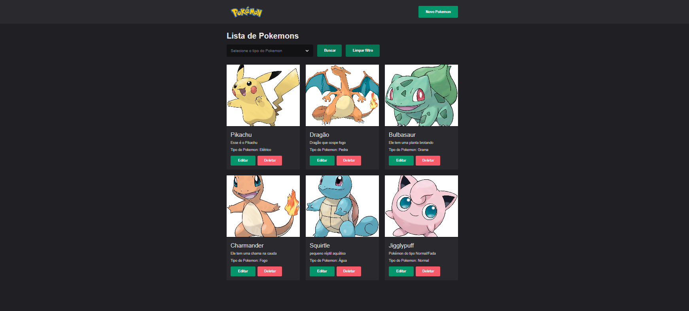
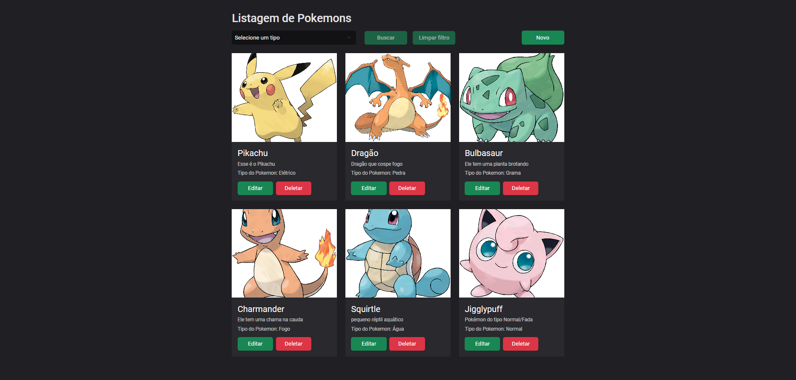
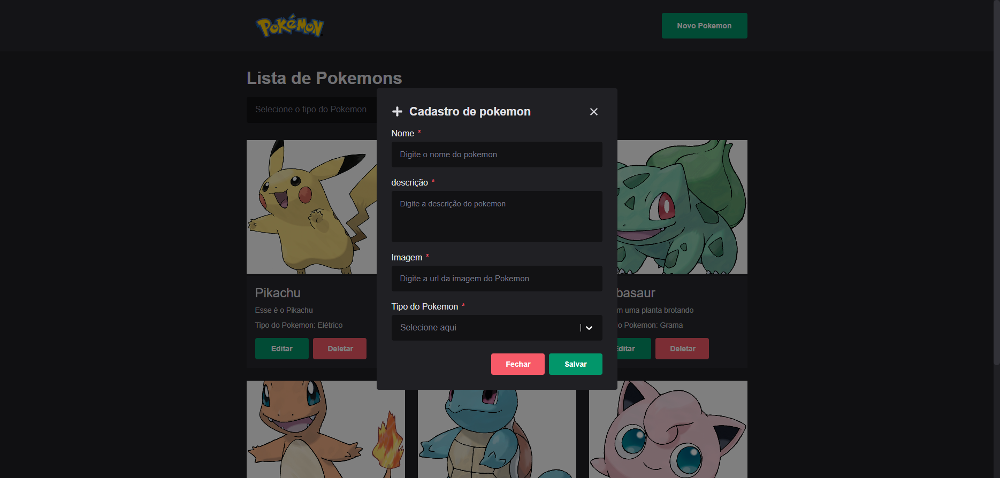
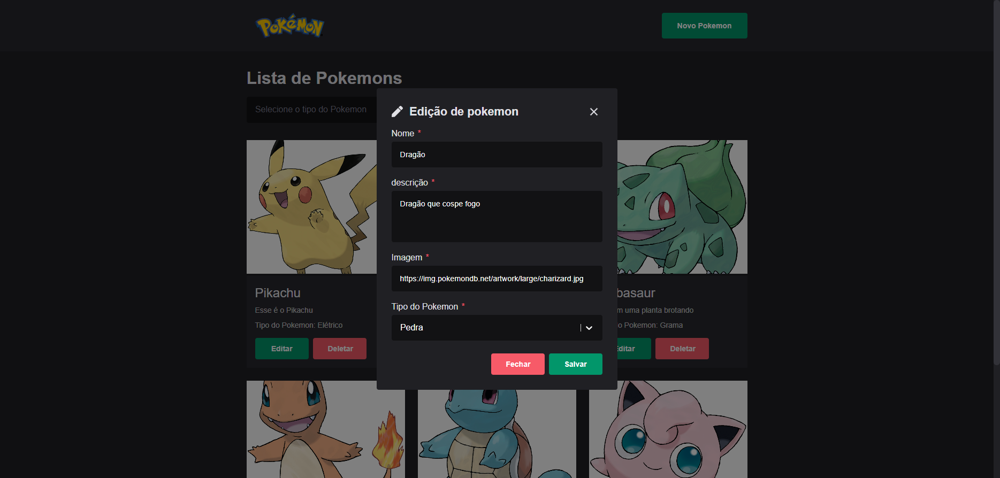
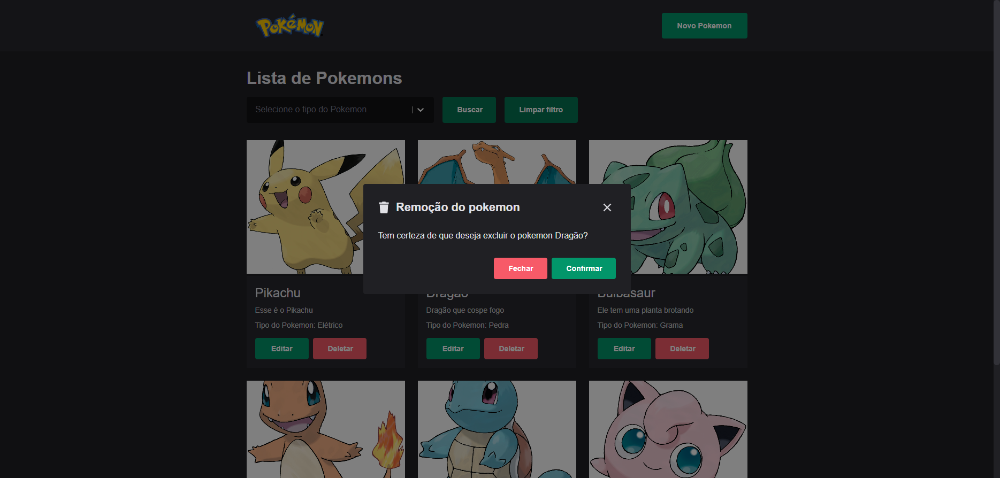

## 🖼️ Frontend - React & Angular

<div style="display: flex; flex-direction: column; gap: 1rem">
  
  
  
  
  
</div>

<br>
<p align="justify">
  A organização de pastas dos projetos Angular e React é feita dividindo as responsabilidades em módulos para organizar o projeto como um todo e facilitar o desenvolvimento. Os modulos são:
</p>

- **components**: Módulo que comporta todos os componentes feitos no projeto;
- **core**: Módulo que possui arquivos e utilitarios essenciais para o funcionamento da aplicação;
- **domain-types**: Módulo referente a todos os tipos criados com o auxilio do Typescript;
- **services**: Módulo que comporta todos os services que fazem comunicação com o Back-End;
- **styles**: Módulo que comporta estilizações globais;
- **pages ou modules**: Módulo que comporta todos os componentes referentes às páginas, seus modais, hooks, serviços que se comunicam e etc.

## 💡 Rodando o Front-End

### Pre-requisitos

<p>Antes de tudo é necessário instalar: </p>

- <a href="https://nodejs.org/pt-br/download/package-manager">Node.js</a>

- Instalando o TypeScript

  ```sh
  npm install -g typescript
  ```

- Instalando o yarn
  ```sh
  npm install --global yarn
  ```
- Verificando se o yarn está instalado

  ```sh
  yarn --version
  ```

- Clonando o respositório

  ```sh
  git clone https://github.com/augustodevjs/undefined-challenge
  ```

- Entre no diretório do (Angular)

  ```sh
  cd ./frontend/angular
  ```

- Instale as dependencias do projeto (Angular)

  ```sh
  npm install
  ```

- Rodando o projeto no modo de desenvolvimento (Angular)

  ```sh
  ng server || ng s || npm start
  ```

- Entre no diretório do (React)

  ```sh
  cd ./frontend/react
  ```

- Instale as dependencias do projeto (React)

  ```sh
  yarn
  ```

- Variável de Ambiente (React & Angular)

  ```sh
  lembre-se de mudar a variável de ambiente

  (Angular) - mude no arquivo environment.development
  (React) - siga o exemplo do arquivo .env.example e crie um arquivo .env
  ```

- Rodando o projeto no modo de desenvolvimento (React)

  ```sh
  yarn run dev
  ```

- Na imagem do Pokemon você pode seguir esse formato da api do pokemon
  ```sh
  https://img.pokemondb.net/artwork/large/{nome-do-pokemon}.jpg
  ```

## :desktop_computer: Principais tecnologias utilizadas no Front-End

- <a href="https://react.dev">React</a>
- <a href="https://angular.io">Angular</a>
- <a href="https://ng-bootstrap.github.io/#/home">Ng Boostrap</a>
- <a href="https://axios-http.com/docs/intro">Axios</a>
- <a href="https://www.typescriptlang.org">TypeScript</a>
- <a href="https://sweetalert2.github.io">Sweet Alert</a>
- <a href="https://react-select.com/home">React Select</a>
- <a href="http://reactcommunity.org/react-modal/">React Modal</a>
- <a href="https://react-hook-form.com">React Hook Form</a>
- <a href="https://styled-components.com">Styled Components</a>

## ⌨️ Back-End

<p align="justify">
Utilizei o framework .NET 7 junto com o Entity Framework para desenvolver a aplicação. Dividi os módulos e conectei tudo ao banco de dados MySQL. Organizei o código seguindo a abordagem de Domain Driven Design (DDD), o que facilitou bastante a implementação de regras de negócios e outros processos complexos. Além disso, incluí testes abrangentes na camada de aplicação, atingindo uma cobertura total de 100%.
</p>
<p align="justify">
  Dito isso, o projeto foi estruturado em 5 "camadas" que são:
</p>

- **API**: Comporta configurações da aplicação e controllers;
- **application**: Cuida da comunicação com o Domain, comportando: classes de serviços, interfaces, DTOs, etc;
- **infra**: Comporta o suporte geral às demais implementações como repositories, contextos e etc;
- **domain**: Comporta todas as entidades, interfaces e validações;
- **tests**: Comporta todos os testes das services.

## 💡 Rodando o Back-End

### Pre-requisitos

- NET SDK
- MySql
- DBeaver

- Entre no diretório do back

  ```sh
  cd ./backend/src/Pokemon.API
  ```

- Rode a API

  ```sh
  dotnet run
  ```

- Para vê os testes unitários do backend entre no diretório

  ```sh
  cd ./backend/tests/Pokemon.Application.Tests
  ```

- Rode os Testes

  ```sh
  dotnet test
  ```

## :desktop_computer: Principais tecnologias utilizadas no Back-End

- <a href="https://learn.microsoft.com/pt-br/dotnet/csharp/">C#</a>
- <a href="https://xunit.net">xUnit</a>
- <a href="https://dotnet.microsoft.com/en-us/download/dotnet/7.0">.NET 7</a>
- <a href="">MySql</a>
- <a href="https://dbeaver.io/download/">DBeaver</a>
- <a href="https://automapper.org">AutoMapper</a>
- <a href="https://fluentvalidation.net">FluentValidation</a>
- <a href="https://developer.mozilla.org/en-US/docs/Web/JavaScript">Entity Framework</a>
